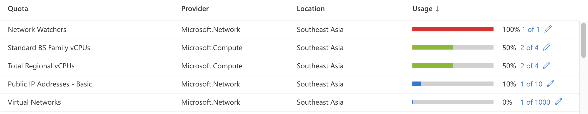

# Azure az vm basic usage

# Azure vCPU limitation 
#### Azure Account default 4vCPU for Free trial account
#### Azure Account default 10vCPU for PAYG account

as a prerequisites to run the az_provision.sh, 
please help upgrade to PAYG account and set the Standard Bs Family vCPUS to 20



#### az vm list-usage -l southeastasia
```
Name                                      CurrentValue    Limit
----------------------------------------  --------------  -------
Total Regional vCPUs                      4               10
Virtual Machines                          2               25000
Dedicated vCPUs                           0               3000
Total Regional Low-priority vCPUs         0               10
Standard BS Family vCPUs                  4               10
```
https://docs.microsoft.com/en-us/azure/azure-portal/supportability/per-vm-quota-requests

# Increase vCPU limitation

1. upgrade your free trial account to pay as you go account (it may took 15 minutes to effective)
2. from the Azure portal home page, Subscription, select default subscripition, Usage + quotas
3. please change the Standard BS Family vCPUs to 20 (which means we can have 10 * 2vCPU VM)


## az vm list-sizes -l southeastasia

https://azureprice.net/ for VM pricing comparison

https://azure.microsoft.com/en-us/pricing/details/virtual-machines/linux/

### the Bs-series VM is the cheapest we can found and the cost is comparable to AWS Lightsail

Bs-series
Bs-series are economical virtual machines that provide a low-cost option for workloads that typically run at a low to moderate baseline CPU performance, but sometimes need to burst to significantly higher CPU performance when the demand rises. These workloads don’t require the use of the full CPU all the time, but occasionally will need to burst to finish some tasks more quickly. Many applications such as development and test servers, low traffic web servers, small databases, micro services, servers for proof-of-concepts, build servers, and code repositories fit into this model.

```
Size             vCPUs       Memory(GiB)       Cost/hour         Monthly Cost/750hour
Standard_B1s        1            1 GiB          $0.0132/hour        $9.9
Standard_B1ms       1            2 GiB          $0.0264/hour        $19.8
Standard_B2s        2            4 GiB          $0.0528/hour        $39.6
Standard_B2ms       2            8 GiB          $0.106/hour         $79.5
Standard_B4ms       4            16 GiB         $0.211/hour         $158.25
Standard_B8ms       8            32 GiB         $0.422/hour         $316.5
Standard_B12ms      12           48 GiB	        $0.634/hour         $475.5
Standard_B16ms      16           64 GiB	        $0.845/hour         $633.75
Standard_B20ms      20           80 GiB	        $1.056/hour         $792
```

## Premium SSD LRS pricing
https://azure.microsoft.com/en-us/pricing/details/managed-disks/#pricing

```
Premium SSD LRS	

Type    Disk Size	    Cost/hour       Price per month	    Max IOPS (Max IOPS w/ bursting)	    Max throughput (Max throughput w/ bursting)
P6	    64 GiB	     $0.0136               $10.21	            240 (3,500)	                        50 MB/second (170 MB/second)
P10	    128 GiB	     $0.0262               $19.71	            500 (3,500)	                        100 MB/second (170 MB/second)
P15	    256 GiB	     $0.0507               $38.02	            1,100 (3,500)	                    125 MB/second (170 MB/second)


```
# az vm image list -f OpenSUSE --all
```
Offer               Publisher                           Sku        Urn                                                              Version
------------------  ----------------------------------  ---------  ---------------------------------------------------------------  ----------
opensuse-gui        noricumcloudsolutions1600524477681  payperuse  noricumcloudsolutions1600524477681:opensuse-gui:payperuse:1.0.1  1.0.1
openSUSE-Leap       SUSE                                15-2       SUSE:openSUSE-Leap:15-2:2020.07.02                               2020.07.02
openSUSE-Leap       SUSE                                15-2-gen2  SUSE:openSUSE-Leap:15-2-gen2:2020.07.02                          2020.07.02
opensuse-leap-15-3  SUSE                                gen1       SUSE:opensuse-leap-15-3:gen1:2021.07.08                          2021.07.08
opensuse-leap-15-3  SUSE                                gen2       SUSE:opensuse-leap-15-3:gen2:2021.07.08                          2021.07.08
```

# Example guide of Azure vm create
https://docs.microsoft.com/en-us/azure/virtual-machines/linux/tutorial-automate-vm-deployment


# cat /Users/<admin>/.azure/config

```
[cloud]
name = AzureCloud

[core]
first_run = yes
output = table

[defaults]
location = southeastasia

``` 

# Step by step Cli   

# az login
```
az login
```

# Set default location and create resources group
```

az config set defaults.location=southeastasia 
az group create --name devsecops

```
Example output
```
Location       Name
-------------  ---------
southeastasia  devsecops
```

# 3. create VM for devsecops workshop

```
az vm create --resource-group $tags \
  --name $VMname \
  --admin-username az-user \
  --image SUSE:opensuse-leap-15-3:gen2:2021.07.08 \
  --size Standard_B2s \
  --generate-ssh-keys \
  --os-disk-size-gb 80 \
  --custom-data cloud-config.txt \
  --no-wait \
  --verbose 
```

## cloud-config.txt
```
#cloud-config
packages:
  - curl
  - sudo
  - docker
  - wget 
  - iputils 
  - vim

# create the docker group
groups:
  - docker

# Add default auto created user to docker group
system_info:
  default_user:
    sudo: ALL=(ALL) NOPASSWD:ALL
    groups: [docker]

runcmd:
  - sudo systemctl enable docker
  - sudo systemctl start docker
```

Example output
```
Name     ResourceGroup    PowerState    PublicIps      Fqdns    Location       Zones
-------  ---------------  ------------  -------------  -------  -------------  -------
rancher  devsecops        VM running    52.187.178.1            southeastasia

```
# open ALL ports per VM

```
az vm open-port -g $tags -n $VMname --port 22,80,443,2376,2379-2380,6443,10250,10254,30000-32767 --priority 100
```

## open ALL ports to All VM per resources group 
```
az vm open-port --ids $(az vm list -g devsecops --query "[].id" -o tsv) --port '*'
```
Example output
```
Location       Name        ProvisioningState    ResourceGroup    ResourceGuid
-------------  ----------  -------------------  ---------------  ------------------------------------
southeastasia  rancherNSG  Succeeded            devsecops        916c44e3-5171-4ba0-a3dd-9f44b3cee145
southeastasia  rke-m1NSG   Succeeded            devsecops        31ed7213-ea37-48b5-85d9-a508ce219da9
```

# get VM info

```
az vm list -g devsecops -d
```
Example output
```
Name     ResourceGroup    PowerState    PublicIps      Fqdns    Location       Zones
-------  ---------------  ------------  -------------  -------  -------------  -------
rancher  devsecops        VM running    52.187.178.1            southeastasia
rke-m1   devsecops        VM running    20.205.191.36           southeastasia
rke-w1   devsecops        VM running    52.230.39.211           southeastasia
rke-w2   devsecops        VM running    40.65.135.87            southeastasia
rke-w3   devsecops        VM running    52.230.36.125           southeastasia
```

# get specified VM public IP address by VM name

```
az vm show -d -g devsecops -n rancher --query publicIps -o tsv
```
Example output
```
52.187.74.168
```

# ssh into VM

```
export ip=$(az vm show -d -g devsecops -n rancher --query publicIps -o tsv)

ssh -i ~/.ssh/id_rsa -o StrictHostKeyChecking=no devsecops@$ip
```


# Delete resources group devsecops to cleanup all resources
```
az group delete --name devsecops --yes
```
